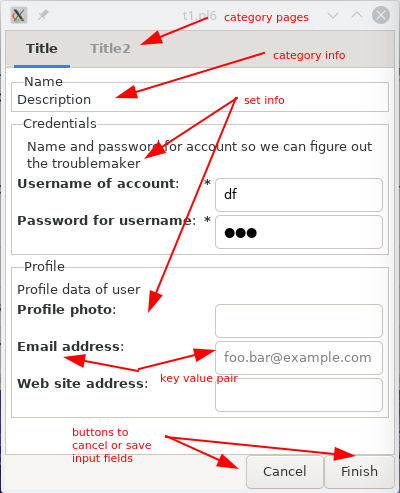
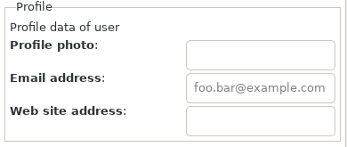

[toc]

# Purpose

Questionnaires and configurations have all some form of key - value sheets serving all kinds of purposes. This library tries to help setting up a question/answer (QA from now on) sheet and store it in the managers environment.

# Setup



* Management of QA sheets. A QA sheet is build up from parts, called sets. A set can be extended with other sets. Every set is stored on disk under some key. A complete QA sheet is then also a set under which the sheet can be pulled using the key for that set.
* Check QA input. All values can be checked for its type and definedness.
* QA graphical user interface. A QA sheet can be presented and filled in. After pressing Ok, Apply or Cancel, the QA sheet is removed from display and the result returned.

## Categories

To keep all sets in a single file would perhaps become unwieldy so it is maybe best to have sets in different files which are then categorized by these files. E.g. All internet sets in an `internet.cfg` or specific sets about politics into `politics.cfg`.

Directory where the set categories are stored will be `$*HOME/.config/QAManager/QA.d` on `*ux` systems. <!-- and `$*HOME/QAManager/QA.d` on Windows.-->

Categories can also have a description and a title.

## Sets

A set is a single level of key - value pairs. The key is a string of letters, digits or underscores. A set has also a name and a short and long description. All texts can be specified in other languages as long the program can access it using an extension on a key.

Summarized
* Name
  * Used in Gui in a Frame widget. When absent, it takes the set key.
  * Referring to a set as a set key from other sets
* Description
  * Used in Gui to describe the use of a set of config settings. Empty when absent.
* key - value pairs
  * QA data. The data returned to the program using the library is a simple Hash with scalar values. The hash can have a hierargy.
  * The QA sets, maintained by the library, are more elaborate to describe the value.

## Key Value Pairs

### Keys

Summarized
* Name; Used in Gui to retrieve the data. Name is set on the input widget.

### Values

Summarized
* Description; Used in Gui to describe the value needed. Empty when absent.
* Type; Number, String, Boolean, Image, Array, Set
  * Number; Int, Rat, Num
  * String; Text, Color, Filename
  * Array; Strings
* Limits, Boolean values like required, encode and stars ar `False` if not mentioned. Default values are '' or 0 when absent. Min and Max are -Inf and Inf when absent. Encoding is using sha256 and stars means that the field will show stars instead of the text typed.
  * Numbers; Hash of required, default, minimum, maximum
  * String; Hash of required, default, encode, stars
  * Boolean; Hash of required, default
  * Image; Hash of required
  * Array; Hash of required
  * ?? Set; Hash of required, category name, set name
* Widget representation. Entry when absent. Each of the representations must show a clue as to whether the field is required. Default values must be filled in (light gray) when value is absent. When another set is referred, a button is placed to show a new dialog with the QA from that set. A boolean value displayed in a ComboBox has two entries with 'Yes' or 'No' as well as for two RadioButtons with 'Yes' or 'No' text.
  * Number; Entry, Scale
  * String; Entry, TextView, ComboBox
  * Boolean; ComboBox, RadioButton, CheckButton, Switch, ToggleButton
  * Image; FileChooserDialog, Drag and Drop
  * Color; ColorChooserDialog
  * File; FileChooserDialog, Drag and Drop
  * Array; ComboBox, CheckButton
  * Set; Button -> Dialog, 2nd page of a Stack or a NoteBook
* Checks on input.
* Repeatability of input fields; e.g. phone numbers
* Repeatability of sets; e.g. username/password sets for more than one account.

# Todo
## Category

## Set

## KV or field specification




### Visual clues on validity of value

* [x] Stylesheet installed in resources
* [x] Border color of entries are specified for faulty (red) and ok entries (green).

### Field specifications
* [x] name; Required. Used as a key in returned data along with category and set. Also used as a name on the widget to find the widget.
* [x] title; Optional. By default it is the first character uppercased of the name.
* [x] description; Optional. By default it uses the title. It is shown in front of the input field.
* [x] type; optional. By default it turns to QAString
  * [ ] QANumber; For all number types Int, Rat, FatRat, Num
  * [x] QAString
  * [x] QABoolean
  * [ ] QAFile; String used for path names
  * [ ] QAArray; Array of values.
  * [ ] QASet

* [x] field; optional
  * [x] QAEntry; Input for text and number. Text can be anything. Default for QAString and QANumber types.
  * [ ] QAScale; Number input.
  * [ ] QATextView; Text input.
  * [ ] QAComboBox; List selects for one selection.
  * [ ] QARadioButton; List selects for one selection.
  * [ ] QAList; List selects. Default for QAArray for multiple selections.
  * [x] QACheckButton; Boolean input. Default for QABoolean types.
  * [ ] QASwitch; Boolean input.
  * [ ] QAToggleButton; Boolean input.
  * [ ] QAFileChooserDialog
  * [ ] QADragAndDrop
  * [ ] QAColorChooserDialog
  * [ ] QADialog
  * [ ] QAStack
  * [ ] QANoteBook
  * [ ] QAImage;

* [ ] minimum; optional
  * [ ] minimum for number type
  * [ ] minimum number of characters for string type
* [ ] maximum; optional range for number type
  * [ ] maximum for number type
  * [ ] maximum number of characters for string type
* [x] default; optional default value for string and number type
* [x] example; optional example value for string type
* [x] tooltip; optional tooltip on input field
* [ ] callback; optional method name to do checks on a value. An object must be provided to search for the method.
* [ ] cmpwith; optional to check value against other field
* [ ] repeatable; boolean value when input is repeatable. Data must be stored in an array. To repeat, field must show a **+** to the right.
* [ ] required; boolean value when input is required. show as a star
* [ ] encode; when value must be encoded with sha256
* [x] invisible; when value is displayed as invisible characters
* [ ] category; when referring to other set
* [ ] set; when referring to other set

# Examples

Representation of QA sheet

```
name,
title,
description,
sets: [
  set1:
    name,
    description,
    keys: [
      key1: { description, type, limits, representation },
      key2: { ... }
    ]
```

Example of a set `credential` stored in category `accounting`.
```
title: 'Accounting',
description: 'QA sheets centered around username, passwords, etc.',
sets: [
  credential:
    title: 'Credentials',
    description: 'Name and password for account',
    keys: [
      username: {
        description: 'Username of account',
        type: string,
        :required,
        :widget(Entry),
      },
      password: {
        'Password for username',
        type: string,
        :encode,
        :stars,
        :widget(Entry),
      }
    ]
  ]
```

Example of a set `database` in some other category, using also the above set `credential`.

```
title: 'Services',
description: 'QA sheets for server services',
sets: [
  database:
    name: 'Mongodb',
    description: 'Mongodb database server data',
    keys: [
      hostname: {
        description: 'Server where database resides',
        type: string,
        :default<localhost>,
      },
      portnumber: {
        description: 'Service port',
        type: number,
        :default(27017),
      },
      user-access: {
        description: 'Database credentials',
        type: set,
        :category('accounting'),
        :set('credential'),
        :widget(Dialog),
      }
    ]
  ]
```

The data returned from the questionnaire is a hash and could contain something like below if the set `database` was used.
```
{ database => {
    :hostname('mdb.example.com'),
    :portnumber(27017),
    user-access => {
      :username('mickey'),
      :password('47c5c28cae2574cdf5a194fe7717de68f8276f4bf83e653830925056aeb32a48')
    }
  }
}
```
