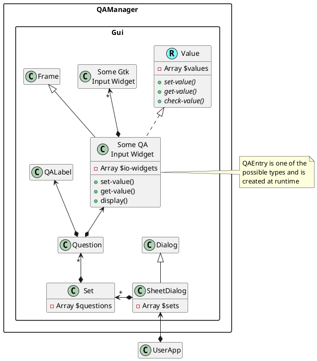

```plantuml
@startuml
'scale 0.9
skinparam packageStyle rectangle
skinparam stereotypeCBackgroundColor #80ffff
set namespaceSeparator ::
hide empty members

'class QAManager::Gui::Frame <<(R,#80ffff)>>
'class QAManager::Gui::Repeat <<(R,#80ffff)>>

class QAManager::Gui::Value <<(R,#80ffff)>> {
  +{abstract} set-value()
  +{abstract} get-value()
  +{abstract} check-value()
  -Array $values
}

class "Some Gtk\nInput Widget" as QAManager::Gui::GtkIOWidget

class "Some QA\nInput Widget" as QAManager::Gui::QAIOWidget {
  -Array $io-widgets
  +set-value()
  +get-value()
  +display()
}

note right of QAManager::Gui::QAIOWidget : QAEntry is one of the\npossible types and is\ncreated at runtime

class QAManager::Gui::Set {
  -Array $questions
}

class QAManager::Gui::SheetDialog {
  -Array $sets
}


QAManager::Gui::Dialog <|-- QAManager::Gui::SheetDialog
QAManager::Gui::Set "*" <-* QAManager::Gui::SheetDialog
'QAManager::Gui::Set *--> QAManager::Set
QAManager::Gui::SheetDialog <--* UserApp

QAManager::Gui::Value <|.. QAManager::Gui::QAIOWidget
QAManager::Gui::GtkIOWidget "*" <--* QAManager::Gui::QAIOWidget
QAManager::Gui::Frame <|-- QAManager::Gui::QAIOWidget
'QAManager::Gui::Repeat <|.. QAManager::Gui::QAIOWidget

QAManager::Gui::QAIOWidget <--* QAManager::Gui::Question
QAManager::Gui::QALabel <--* QAManager::Gui::Question

QAManager::Gui::Question "*" <--* QAManager::Gui::Set

@enduml
```
