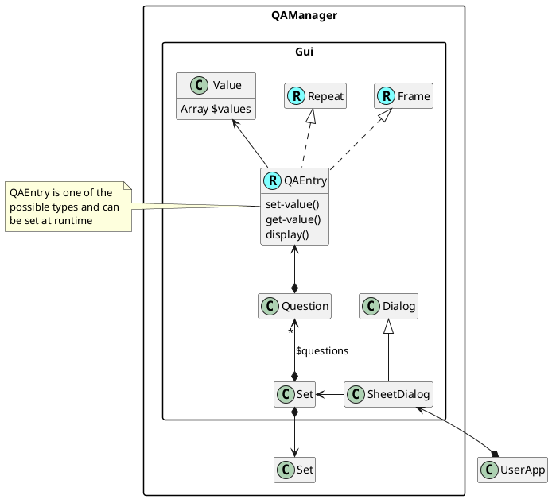

```plantuml
@startuml
'scale 0.9
skinparam packageStyle rectangle
skinparam stereotypeCBackgroundColor #80ffff
set namespaceSeparator ::
hide empty members

class QAManager::Gui::Frame <<(R,#80ffff)>>
class QAManager::Gui::Repeat <<(R,#80ffff)>>
'class QAManager::Gui::QAFieldType

class QAManager::Gui::Value {
  Array $values
}


class QAManager::Gui::QAEntry <<(R,#80ffff)>> {
  set-value()
  get-value()
  display()
}

note left of QAManager::Gui::QAEntry : QAEntry is one of the\npossible types and can\nbe set at runtime


'Gnome::Gtk3::Dialog <|-- QAManager::Gui::Dialog
QAManager::Gui::Dialog <|-- QAManager::Gui::SheetDialog
QAManager::Gui::Set <- QAManager::Gui::SheetDialog
QAManager::Gui::Set *--> QAManager::Set
QAManager::Gui::SheetDialog <--* UserApp

'Gnome::Gtk3::Frame <|-- QAManager::Gui::Frame
QAManager::Gui::Value <-- QAManager::Gui::QAEntry

QAManager::Gui::Frame <|.. QAManager::Gui::QAEntry
QAManager::Gui::Repeat <|.. QAManager::Gui::QAEntry
'QAManager::Gui::QAEntry <|. QAManager::Gui::QAFieldType

QAManager::Gui::QAEntry <--* QAManager::Gui::Question
'Gnome::Gtk3::Label <--* QAManager::Gui::Question

QAManager::Gui::Question "*" <--* QAManager::Gui::Set : $questions

@enduml
```
