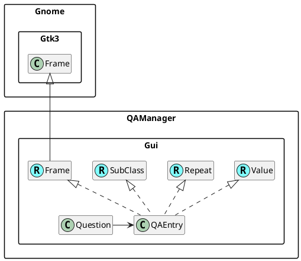

```plantuml
@startuml
'scale 0.9
skinparam packageStyle rectangle
skinparam stereotypeCBackgroundColor #80ffff
set namespaceSeparator ::
hide members

'class QAManager::Gui::ValueRepr <<(R,#80ffff)>>


class QAManager::Gui::Value <<(R,#80ffff)>>
class QAManager::Gui::Repeat <<(R,#80ffff)>>
class QAManager::Gui::SubClass <<(R,#80ffff)>>
class QAManager::Gui::Frame <<(R,#80ffff)>>

Gnome::Gtk3::Frame <|-- QAManager::Gui::Frame
QAManager::Gui::Frame <|.. QAManager::Gui::QAEntry
QAManager::Gui::Repeat <|.. QAManager::Gui::QAEntry
QAManager::Gui::Value <|.. QAManager::Gui::QAEntry
QAManager::Gui::SubClass <|.. QAManager::Gui::QAEntry

QAManager::Gui::Question -> QAManager::Gui::QAEntry


'QAManager::Category -> QAManager::Set
'QAManager::Category --> QAManager::KV

'QAManager::Set --> QAManager::KV

'QAManager::KV --> QAManager::QATypes

'Gnome::Gtk3::Dialog <|-- QAManager::Gui::Dialog
'QAManager::Gui::Dialog <|-- QAManager::Gui::Part::Set

'QAManager::Gui::Part::Set -> QAManager::Set
'QAManager::Gui::Part::Set --> QAManager::Gui::Part::KV

'QAManager::Gui::Frame <-- QAManager::Gui::Part::Set
'Gnome::Gtk3::Frame <|-- QAManager::Gui::Frame

'QAManager::Gui::Part::KV --> QAManager::QATypes
'QAManager::Gui::Part::KV -> QAManager::KV
'QAManager::Set <-- QAManager::Gui::Part::KV
'QAManager::Gui::Part::KV --> QAManager::Gui::Part::GroupFrame
'QAManager::Gui::Part::KV -> QAManager::Gui::Part::EntryFrame

'Gnome::Gtk3::Frame <|----- QAManager::Gui::Part::GroupFrame
'Gnome::Gtk3::Frame <|----- QAManager::Gui::Part::EntryFrame

'hide <<Role>> circle
'QAManager::Gui::Part::EntryFrame -|> QAManager::Gui::ValueRepr

'QAManager::Gui::Part::Entry <|-- QAManager::Gui::Part::EntryFrame

@enduml
```
