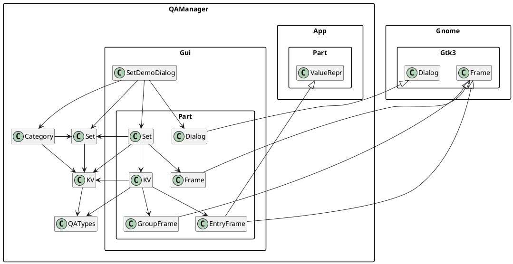

```plantuml
@startuml
'scale 0.9
skinparam packageStyle rectangle
set namespaceSeparator ::
hide members

'application -> QAManager::App::Application

'QAManager::App::Application --> QAManager::App::ApplicationWindow
'QAManager::App::Application ---> QAManager::App::Menu::File
'QAManager::App::Application -> QAManager::App::Menu::Help
'QAManager::App::Application --> QAManager::App::Page::Category
'QAManager::App::Application --> QAManager::App::Page::Sheet
'QAManager::App::Application --> QAManager::App::Page::Set
'Gnome::Gtk3::Application <|-- QAManager::App::Application

'QAManager::App::Page::Category --> QAManager::Category
'Gnome::Gtk3::Grid <|--- QAManager::App::Page::Category

'QAManager::App::Page::Sheet --> QAManager::Sheet
'Gnome::Gtk3::Grid <|--- QAManager::App::Page::Sheet

'QAManager::App::Page::Set --> QAManager::Category
'QAManager::App::Page::Set --> QAManager::Set
'QAManager::App::Page::Set --> QAManager::KV
'QAManager::App::Page::Set --> QAManager::Gui::DeleteMsgDialog
'QAManager::App::Page::Set --> QAManager::Gui::SetDemoDialog

'Gnome::Gtk3::Grid <|-- QAManager::App::Page::Set

'QAManager --> QAManager::Category
'QAManager --> QAManager::Sheet
'QAManager --> QAManager::Gui::TopLevel

QAManager::Category -> QAManager::Set
QAManager::Category --> QAManager::KV

'QAManager::Sheet --> QAManager::QATypes

'QAManager::Gui::TopLevel --> QAManager::Gui::Main

QAManager::Set --> QAManager::KV

QAManager::KV --> QAManager::QATypes

'QAManager::Gui::Main --> QAManager::QATypes
'QAManager::Gui::Main --> QAManager::Set

'Gnome::Gtk3::MessageDialog <|-- QAManager::Gui::DeleteMsgDialog

'QAManager::Gui::SetDemoDialog --> QAManager::QATypes
QAManager::Gui::SetDemoDialog --> QAManager::Category
QAManager::Gui::SetDemoDialog --> QAManager::Set
QAManager::Gui::SetDemoDialog --> QAManager::Gui::Part::Dialog
QAManager::Gui::SetDemoDialog --> QAManager::Gui::Part::Set

Gnome::Gtk3::Dialog <|-- QAManager::Gui::Part::Dialog

QAManager::Gui::Part::Set -> QAManager::Set
QAManager::Gui::Part::Set --> QAManager::KV
QAManager::Gui::Part::Set --> QAManager::Gui::Part::KV
QAManager::Gui::Part::Set --> QAManager::Gui::Part::Frame

Gnome::Gtk3::Frame <|-- QAManager::Gui::Part::Frame

QAManager::Gui::Part::KV --> QAManager::QATypes
QAManager::Gui::Part::KV -> QAManager::KV
QAManager::Gui::Part::KV --> QAManager::Gui::Part::GroupFrame
QAManager::Gui::Part::KV --> QAManager::Gui::Part::EntryFrame

Gnome::Gtk3::Frame <|-- QAManager::Gui::Part::GroupFrame
Gnome::Gtk3::Frame <|-- QAManager::Gui::Part::EntryFrame
QAManager::App::Part::ValueRepr <|---- QAManager::Gui::Part::EntryFrame

@enduml
```
