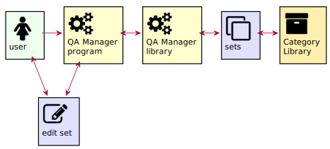
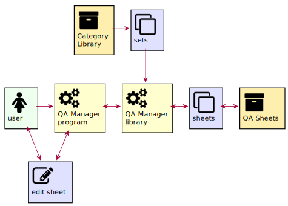
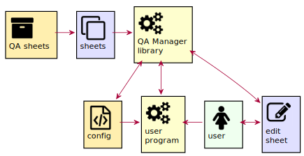

# Introduction

Questionnaires and configurations all have a series of questions or settings and fields where you can fill in answers or values. Sometimes, questions are grouped around a subject or section. The way to display them can also vary. For example, several groups of questions can be shown on one pages or displayed of several pages. It can also be guided using an assistant. You see those more often with e.g. an installation of a software. This package tries to provide those for you.

There are 3 main tasks the package will provide
* Define Categories. A number of sets holding questions will form a category. A category is e.g. a subject where the questions are about. An example category could be `Network` where a set of questions can be about the connection to some server or user credentials or profile. This is a configuration and storage task.
  

* Define QA sheets. From the categories, sets can be selected from the categories to build a questionaire.
  

* Running QA sheets. When a questionaire is defined, it can be retrieved and displayed by a user application. When the user hits some finish key, the answers to the questions can be checked and saved in the applications config environment.
  
