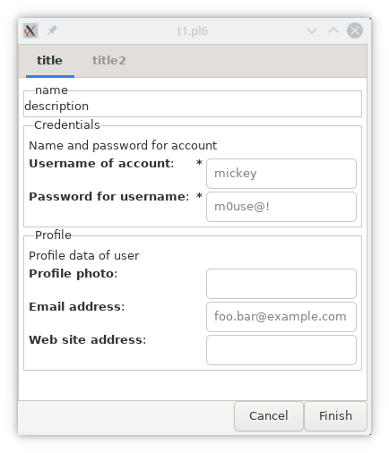

# Introduction

Questionnaires and configurations all have a series of questions and something where you can fill in answers or values. Sometimes, questions are grouped around a subject or section. The way to display them can also vary. For example, several groups of questions can be shown on one page or displayed over several pages. The user can also be guided by an assistant. You see assistants more often e.g. when installing a software. This package tries to provide those for you.

There are 3 main tasks the package will provide
* Define `Categories`. A number of sets holding questions will form a `Category`. Categories are like archives of sets around a subject. A `Set` is a series of questions. An example category could be _Network_. The sets in that category can be about server connections, user credentials or a user profile. This is a configuration and storage task.
  

* Define QA `Sheets`. From the categories, sets can be selected to build a questionaire. A `Sheet` can have one or more pages and each page can have one or more sets. The sheet is the final product which an application can use.
  

* Running QA sheets. When a questionaire is defined, it can be retrieved and displayed by a user application. When the user hits some finish key, the answers to the questions can be checked and saved in the applications config environment.
  

# Locations

There are several locations involved where questionaires and categories are stored. The results of the query is stored at a standard location if not changed.

Using definitions of [Free Desktop](https://freedesktop.org/wiki/);
* Categories are stored in a directory at `$*HOME/.config/QAManager/QAlib.d`. On windows, this might become a bit different. The file is a JSON formatted file having a 'cfg' extention. The category name is the filename without the extention.
* Sheets are stored at `$*HOME/.config/QAManager/QA.d` and are also JSON formatted files.
* Sheets which are used by the program to create categories and sheets are stored in the apps resources directory.


# Examples
## Login screen
## Account definition form


## Installation script

# Structures

Some raw structures are shown to have an idea how the files are defined;

* Category files. A category description is not needed because it is only for archiving sets.
```
sets [
  set1
    set name
    title
    description
    entries [
      entry1
        question1
        question2
        ...

      entry2
        ...
    ]

  set2
    ...
]

template sets [
  template1
    ...
]
```

* Sheet files.
```
pages [
  display type
  display properties
  page1
    page name
    title
    description
    sets [
      set1
        category name
        set name

      set2
        ...
    ]

    template sets [
      template1
        ...
]

  page2
    ...
]

template pages [
  template1
    ...
]
```

* Result configuration returned from presented sheet is a **Hash**.
```
page1 => {
  set1 => {
    question1 => [value1, ...]        ??
    question2 => [value2, ...]        ??
    ...
  },
  set2 => {
    ...
  }
},

page2 => {
  ...
}
```
Values of questions must be looked into. At least it must be the same for all type of questions I think.

# Todo notes:

* Change questionaire after a combobox selection, check- or radio button clicks or switch changes. Solutions to implement this can be
  * Template sets and pages. This can be used when a new set or page must be inserted to repeat a set of data.
  * All sets and pages are defined with a hiding control so the visibility can be switched on or off.
  * Make use of user objects with callbacks defined. Already useful to check on data besides requiredness which is handled by the manager. The callback can define actions which in turn call the manager routines to add pages from the templates. Other actions might be to hide a page.

  Some ideas for it
  * Fill a combobox with values after selection of another combobox.
  * Remove or add pages or sets in the questionaire depending on other input. Perhaps using a template describing what is on the page or set.

* Many input widget types are already available but perhaps add a ...
  * Listbox
  * Treeview
  * Pane
